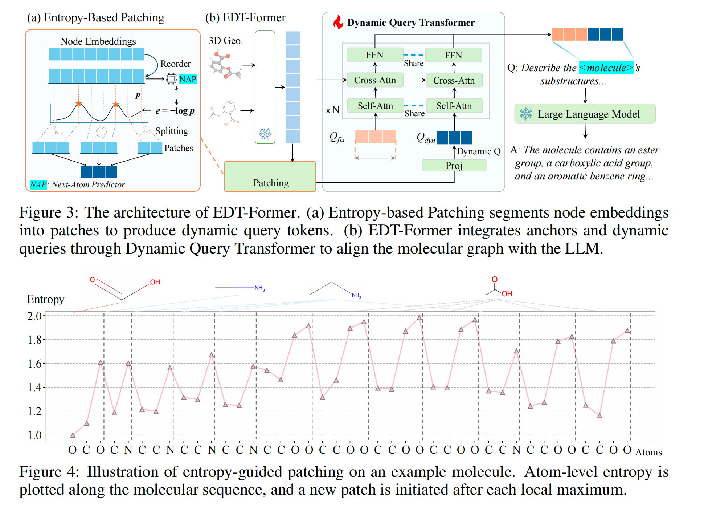

# EDT-Former: Entropy-Guided Dynamic Tokens for Graph-LLM Alignment in Molecular Understanding

> This paper has been submitted to ICLR 2026 (anonymous submission).

### Introduction
Molecular understanding is central to scientific and drug discovery, yet LLMs struggle with molecular graphs. Prior graph–LLM connectors typically adapt Q-Former-style static tokens designed for vision, overlooking stereochemistry and substructural context and often requiring costly LLM-backbone fine-tuning. EDT-Former introduces Entropy-guided Dynamic Tokens that align with informative molecular patches, preserving local and global structure. This enables alignment between frozen graph encoders and LLMs without tuning the LLM backbone, leading to efficient fine-tuning and strong results on MoleculeQA and Mol-Instructions.



### Environment Setup (conda)
- **Prerequisites**: CUDA-ready PyTorch, Conda (miniconda/anaconda), and git.
- Create and activate the environment:
```bash
conda create -n edtformer python=3.10 -y
conda activate edtformer
pip install -r requirements.txt
```
- (Optional) Initialize environment variables (edit paths first):
```bash
# copy and edit
cp init_env.sh init_env.local.sh
# In init_env.local.sh set HF_HOME, BASE_DIR, DATA_DIR, CUDA_VISIBLE_DEVICES
source init_env.local.sh
```

### Data
- Place datasets under `data/` (see `data/`, `configs/*/data_config.yaml`).
- Preprocessing helpers are in `scripts/preprocess/`.

### Pretraining (Stage 1)
The main entrypoint is `stage1.py`.
```bash
python stage1.py \
  --train_config_path configs/stage1/train_config.yaml \
  --data_config_path  configs/stage1/data_config.yaml
```
Notes:
- Checkpoints are saved to `checkpoints/<filename>/` as defined in the train config.
- Use `--test_mode` for a quick smoke test.

### Finetuning / Instruction Tuning (Stage 2)
The main entrypoint is `stage2.py`.
```bash
python stage2.py \
  --train_config_path configs/stage2/train_config.yaml \
  --data_config_path  configs/stage2/data_config.yaml
```
Common options:
- `--test_mode`: small subset run
- `--resume_from last` or a path: resume training

Ensure the Stage 1 checkpoint path is set in the Stage 2 train config (e.g., `train_config.stage1_path`).

### Downstream Example: MoleculeQA
Train/evaluate MoleculeQA with the main script in `evaluation/moleculeqa.py`:
```bash
python evaluation/moleculeqa.py \
  --train_config_path configs/moleculeqa/train_config.yaml \
  --data_config_path  configs/moleculeqa/data_config.yaml
```
Or use the provided helper script (edit `BASE_DIR`/`DATA_DIR` first):
```bash
bash scripts/MoleculeQA/dqw2d.sh
```


### License
See `LICENSE`.

